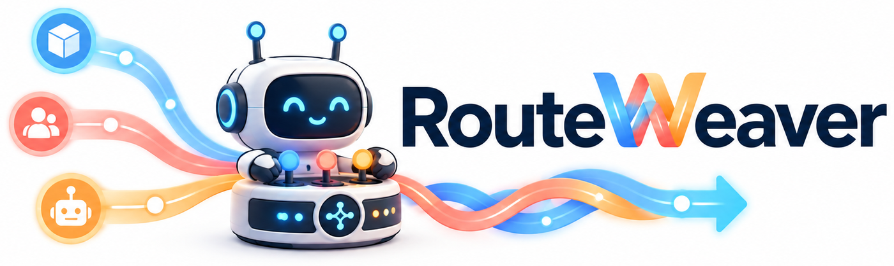
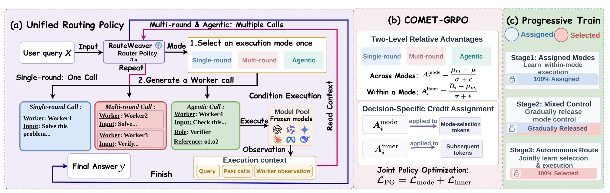

<p align="center">
  
</p>

<h1 align="center">RouteWeaver: Weaving Mode Selection and Execution into Unified LLM Routing</h1>

<p align="center">
  <a href="https://laughking.github.io/RouteWeaver/"></a>
  <a href="#"></a>
  <a href="https://huggingface.co/e2rea1/RouteWeaver-4B"></a>
  <a href="https://github.com/LaughKing/RouteWeaver/stargazers"></a>
  <a href="https://github.com/LaughKing/RouteWeaver/forks"></a>
  <a href="https://github.com/LaughKing/RouteWeaver/issues"></a>
  <a href="LICENSE"></a>
</p>

<p align="center">
  Xiaohan Wang<sup>1,2</sup>&nbsp;&nbsp; Haozhen Zhang<sup>1</sup>&nbsp;&nbsp; Qingyuan Liu<sup>1</sup>&nbsp;&nbsp; Tao Feng<sup>3</sup>&nbsp;&nbsp; Wenya Wang<sup>1</sup>
  <br>
  <sup>1</sup>Nanyang Technological University&nbsp;&nbsp;
  <sup>2</sup>Huazhong University of Science and Technology&nbsp;&nbsp;
  <sup>3</sup>University of Illinois Urbana-Champaign
</p>

<p align="center">
  
</p>

## 📰 News

- **[2026-10]** Code released, the trained router is on the Hub, and the
  [project page](https://laughking.github.io/RouteWeaver/) is up. Paper on arXiv
  coming soon.

## 🧠 Overview

Existing LLM routers fix the **execution paradigm** in advance — single-round,
multi-round or agentic — so they adapt *which* models to call but not *how* the
calls are organized. **RouteWeaver** makes the paradigm itself a routing
decision: one policy (Qwen3-4B-Instruct-2507) first selects a mode, then routes
frozen workers inside it.

- **Unified trajectory.** One action grammar covers all three modes:
  `<mode>m</mode>`, then `<route model=… [role=… refs=…]>sub-query</route>`
  calls interleaved with environment `<observation>`s, then `<answer>`.
  Single-round is exactly one worker call, multi-round two to four sequential
  calls, agentic up to eight calls over role- and reference-structured layers.
- **COMET-GRPO** (COordinated Mode–Execution Training) splits the
  trajectory-level advantage into an across-mode term `A_mode`, carried by the
  mode-decision tokens, and a within-mode term `A_inner`, carried by every
  later router token — then normalizes each segment by its own token count so
  the mode decision is not down-weighted for serializing into ~7 tokens.
- **Progressive exploration** anneals the policy from externally assigned modes
  to autonomous selection (`ρ_b`: all-forced → mixed → all-free), with a
  minimum-support term that keeps probability mass on every mode during the
  transition. Without it the policy collapses to single-round entirely.
- **Cost-aware training.** A second reward component `S_cost = 1/(1+C/C_ref)`
  is normalized separately and mixed with weight `α`, giving one policy a family
  of accuracy–cost operating points.

The router is trained; the six workers are frozen and are only ever addressed by
anonymous IDs with capability descriptions — never by model name or price.

## 🚀 Installation

Python 3.12, CUDA 12.8, 2× 80 GB GPUs for a training run (1 for evaluation).

```bash
git clone https://github.com/LaughKing/RouteWeaver.git && cd RouteWeaver
bash setup_env.sh                      # conda env "routeweaver", pins in order
conda activate routeweaver
```

`setup_env.sh` is the install order the reported runs used; `requirements.txt`
lists the direct pins and `requirements.lock.txt` is the full `pip freeze` of
that environment. verl is installed from its **official v0.8.0 tag and is never
patched** — everything RouteWeaver adds is installed at import time by
`trainers/sitecustomize.py`, which is why `trainers/` must stay on `PYTHONPATH`
(the launcher handles this).

## ⚙️ Configuration

`scripts/paper_config.sh` holds the configuration shared by every reported run.
Paths come from the environment:

| Variable | Default | Purpose |
|---|---|---|
| `ROUTER_MODEL` | `$HOME/models/Qwen3-4B-Instruct-2507` | local router snapshot (full fine-tuning) |
| `ROUTEWEAVER_DATASETS` | `<repo>/datasets` | where the prepared parquets live (see `data/README.md`) |
| `ROUTEWEAVER_OUTPUTS` | `<repo>/outputs` | checkpoints, HF exports, evaluation dumps |
| `PY` | `python` | interpreter of the training env |

### The six workers

`configs/route_channels.yaml` maps `worker_1 .. worker_6` to endpoints — the
router only ever emits the anonymous id, so this file is the only place a
worker's identity lives. Four go through OpenRouter with the provider pinned
(so a worker's backend cannot change between runs), reading the key from
`~/.secrets/routeweaver/openrouter.key` and honouring an `openrouter.STOP`
spend guard beside it. **Two are served locally and you have to start them**,
on the ports the config expects:

```bash
vllm serve Qwen/Qwen3-8B                 --port 8012   # worker_1
vllm serve meta-llama/Llama-3.1-8B-Instruct --port 8010 # worker_2
```

Any worker can be repointed by editing its entry's `base_url`, `model` and
`auth` — including to a different model entirely. The pool's composition is
reported in Appendix D; a different pool is a different action space, so
`routing/worker_registry.py` and `rewards/cost_model.py` carry the prices and
`worker_alias.py` the capability descriptions the prompt renders.

The run-level knobs:

| Variable | Default | Meaning |
|---|---|---|
| `ADV_ESTIMATOR` | `comet_grpo` / `comet_gdpo` / `grpo_gated` | COMET-GRPO, its per-reward-component form, or ordinary gated GRPO |
| `ROUTEWEAVER_COMET` | `1` | two-level credit assignment on free groups |
| `ROUTEWEAVER_LOSS_REDUCTION` | `segment` | `L_mode/N_mode + L_inner/N_inner` instead of one global token mean |
| `ROUTEWEAVER_SUPPORT`, `SUPPORT_LAMBDA0`, `SUPPORT_FLOOR` | `1`, `0.002`, `0.05` | minimum-support term, `λ_b = λ₀·ρ_b` |
| `FORCED_START_BATCH`, `FORCED_ANNEAL_STEPS` | `25`, `50` | `ρ_b` falls from 1 at batch 25 to 0 at batch 75 |
| `COST_ALPHA`, `C_REF` | `0` / `0.1` / `0.3` / `0.5`, `configs/cost_ref.json` | efficiency-reward weight and its frozen normalizer |

## 📦 Preparing data

The repository ships **code only**. One command fetches the prepared parquets
the training and evaluation scripts read:

```bash
export ROUTEWEAVER_DATASETS=/path/to/datasets     # default: <repo>/datasets
python data/hf_download.py
```

Each question is stored as a verl prompt row with the mode menu and the six
anonymous worker ids baked in, so a prompt cannot drift with the code. The
dataset card lists the row format and the per-file composition;
[`data/README.md`](data/README.md) says where the scripts look.

## 🏋️ Training

A run moves through the three phases of progressive exploration. Each script
resolves its full configuration and validates the dataset before launching; add
`DRY_RUN=1` to see that configuration and launch nothing.

A run needs two GPUs; set `CUDA_VISIBLE_DEVICES` to the pair you want.

```bash
# phase 1 — cold start: all queries forced, ordinary gated GRPO
bash scripts/train.sh cold

# phases 2-3 — forced/free transition then autonomous routing, with COMET-GRPO
bash scripts/train.sh main                    # alpha = 0
ALPHA=0.1 bash scripts/train.sh main          # also 0.3, 0.5

# ablations
bash scripts/train.sh wo_comet
bash scripts/train.sh wo_progressive
```

Every α > 0 run resumes the **same** cold-start checkpoint as α = 0 and reads
the frozen `C_ref` from `configs/cost_ref.json`;
`bash scripts/train.sh calibration` is the rollout that produced it.

## 🧪 Evaluation

Greedy router decoding, one system rollout per question, workers at temperature
0.2 — the training launcher in `VAL_ONLY` mode, so evaluation and training share
one code path.

```bash
CKPT=outputs/routeweaver_alpha0/checkpoints/<checkpoint> \
TAG=routeweaver_a0 GPU=<id> OOD=1 bash scripts/eval.sh paper
```

Evaluation needs one GPU. That merges the checkpoint to HF once, runs the nine
in-distribution benchmarks (1,060 questions) and, with `OOD=1`, the held-out
ones, then prints per-dataset accuracy, the five domain means, `Avg`, and the
share of questions routed to each mode.

`bash scripts/eval.sh one` evaluates one checkpoint on one parquet, and
`COST=1` adds the per-call worker-cost columns used for the cost analyses.
Scoring is `evaluation/bench_scoring.py::score_final_output` for training,
evaluation and every baseline alike.

## 🤖 Model

`RouteWeaver-4B` is the released router: Qwen3-4B-Instruct-2507 with all
parameters fine-tuned, trained with α = 0 (task reward only), which is the
model behind the reported accuracies. It is a plain HF causal LM, so it loads
the usual way, but it is a **routing policy**: it emits `<mode>` and `<route>`
actions, and it only does something useful inside the agent loop in this
repository, against a worker pool it can call.

```python
from transformers import AutoModelForCausalLM, AutoTokenizer
model = AutoModelForCausalLM.from_pretrained("e2rea1/RouteWeaver-4B", dtype="bfloat16")
tok = AutoTokenizer.from_pretrained("e2rea1/RouteWeaver-4B")
```

The cost-aware variants are released separately in
[`RouteWeaver-4B-cost`](https://huggingface.co/e2rea1/RouteWeaver-4B-cost), one
subdirectory per efficiency weight (`alpha-0.1`, `alpha-0.3`, `alpha-0.5`),
trained identically except for `COST_ALPHA`:

```python
model = AutoModelForCausalLM.from_pretrained(
    "e2rea1/RouteWeaver-4B-cost", subfolder="alpha-0.3", dtype="bfloat16")
```

`scripts/eval.sh` takes a Hub snapshot directly, so the paper's protocol runs
against the released weights:

```bash
CKPT=$(python -c "from huggingface_hub import snapshot_download as d; print(d('e2rea1/RouteWeaver-4B'))")
TAG=routeweaver GPU=<id> OOD=1 bash scripts/eval.sh paper
```

A checkpoint written by training is FSDP-sharded; `tools/merge_ckpt_to_hf.py`
turns one into this single-file HF layout:

```bash
python tools/merge_ckpt_to_hf.py \
    --ckpt outputs/routeweaver_alpha0/checkpoints/<checkpoint>/actor \
    --out  outputs/hf_export/routeweaver_alpha0
```

## 🗺️ Repository layout

```
agent_loops/    unified trajectory and rollout
  base_loop.py        turn generation, observation budget, token accounting
  unified_loop.py     mode declaration + the three modes' execution
  routeweaver_loop.py forced/free arm per query (the loop every run registers)
trainers/       COMET-GRPO and progressive exploration
  sitecustomize.py    installs everything below into verl at import time
  comet_grpo.py       A_mode / A_inner
  comet_gdpo.py       the same, per reward component, α-mixed
  segment_loss.py     per-segment loss normalization
  support_loss.py / support_hook.py   minimum-support term
  exploration_schedule.py             ρ_b
  grpo_gated.py       GRPO + zero-variance gate + dispatch (infrastructure) gate
rewards/        task reward, efficiency reward, fixed price table, scorers
routing/        action grammar, worker registry, anonymous aliases, dispatch
evaluation/     the judge (bench_scoring), the vendored code harnesses,
                summarize_paper
data/           where the datasets are fetched to
configs/        worker channels, agent-loop registration, frozen C_ref
scripts/        train.sh / eval.sh (the two entry points) over
                train_routeweaver.sh, with paper_config.sh for the shared settings
tools/          checkpoint -> HF export, and C_ref from a calibration rollout
```

## 🙏 Acknowledgments

Built on [verl](https://github.com/volcengine/verl) and
[vLLM](https://github.com/vllm-project/vllm). See [NOTICE](./NOTICE) for the
code this work derives from.

## 📚 Citation

<!-- The arXiv badge above and the eprint id below are the last things to
     fill in, once the paper is up. -->
```bibtex
@article{routeweaver2026,
  title   = {RouteWeaver: Weaving Mode Selection and Execution into Unified LLM Routing},
  author  = {Wang, Xiaohan and Zhang, Haozhen and Liu, Qingyuan and Feng, Tao and Wang, Wenya},
  journal = {arXiv preprint arXiv:TODO},
  year    = {2026}
}
```
